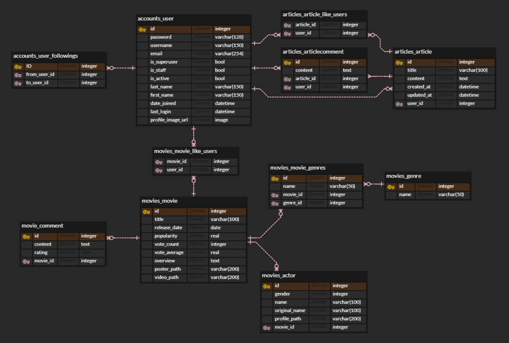

# GIXBOX

<br>

## 1. 팀원 소개

| [](https://github.com/seungtaeryu/) | [](https://github.com/becoding96) | [](https://github.com/soheemoon37) |
| ------------------------------------------------------------ | ------------------------------------------------------------ | ------------------------------------------------------------ |
| **류승태**                                                   | **백준봉**                                                   | **문소희**                                                   |
| **메인 페이지, 영화 전체 보기, 검색 기능**                   | **BE: 유저, 게시판, 영화 추천 알고리즘 / FE: 프로필 페이지**                               | **영화 상세 페이지, 네브바 구현**                            |

<br>

## 2. 프로젝트 소개

### 프로젝트 기간

- 기획 및 설계 : 22.11.08 ~ 22.11.15
- 프로젝트 개발 :  22.11.16 ~ 22.11.25

### 프로젝트 기획, 설명

- 커뮤니티 활성화를 통한 영화 추천 기반 사이트
  - 깃허브의 잔디 히트맵 기능 및 자유로운 커뮤니티를 통해 적극적인 활동을 유도
  - 활동을 통해 얻어진 데이터를 기반으로 사용자에게 알맞는 영화를 추천

<br>

## 3. 데이터베이스 모델링 ERD 설계



<br>

## 4. 주요 서비스 화면&기능

#### <프로필>


**프로필 페이지**입니다.
**활동 내역**을 기반으로 **히트맵(잔디)** 이 활성화됩니다.
활동 내역에는 영화 감상평, 작성 게시글, 게시판 댓글이 포함되며,
버튼을 클릭시 해당 영화 or 게시글(댓글인 경우에는 댓글이 작성된 게시글)로 이동합니다.
네브바를 통해서 활동 내역, 찜한 영화, 좋아하는 게시글 중 원하는 화면으로 전환할 수 있습니다.


**찜한 영화 페이지**입니다.
포스터를 클릭시 해당 영화 페이지로 이동합니다.


**좋아요한 게시글 페이지**입니다.
버튼을 클릭시 해당 게시글로 이동합니다.


**팔로워 목록**입니다. _( 팔로우 목록 동일 )_
프로필 하단의 followers 또는 followings 글자를 클릭하면 해당 유저 목록을 보여줍니다.
프로필 버튼 클릭 시 해당 유저 프로필로 이동합니다.

<br>

#### <영화>


**메인 화면**입니다.
**추천 영화([추천 기준은?](#5-영화-추천-알고리즘)), 최신 영화, 장르별 영화**로 구성되어 있습니다.
각 포스터를 클릭 시 해당 영화 페이지로 이동합니다.
_(모든 페이지의 영화 포스터 해당)_
장르별 영화에서 장르를 선택하면 해당 장르의 영화들이 표시되며,
더 보기를 누르면 해당 장르 영화 전체를 볼 수 있는 페이지가 나옵니다.


**장르 영화 전체 페이지**입니다.
페이지네이션이 구현되어 있습니다.


**영화 디테일 페이지**입니다.
Play Trailer 버튼 클릭 시 **예고편**이 재생됩니다.
댓글 쓰기 버튼 클릭 시 **댓글** 작성 모달이 팝업됩니다.
배우들의 프로필 이미지를 클릭하면 TMDB 사이트의 **배우 프로필**로 이동합니다.
댓글은 본인이 작성한 것만 수정, 삭제가 가능합니다.


**댓글 작성 모달**입니다.


**영화 검색 페이지**입니다.
검색 내용이 제목에 포함된 영화 목록을 출력합니다.

<br>

#### <커뮤니티(게시판)>


**커뮤니티 게시판**입니다.
게시글 제목을 클릭 시 게시글 상세 페이지로 이동합니다.
게시글 작성자를 클릭 시 해당 작성자의 프로필로 이동합니다.
게시글 작성 버튼을 클릭하면 게시글 작성 모달 창이 팝업됩니다.
인피니티 스크롤로 구현되어 있습니다.


**게시글 작성 모달**입니다.


**게시글 상세 페이지**입니다.
좋아요 기능이 구현되어 있습니다.
게시글 댓글은 본인만 수정, 삭제가 가능합니다.


**게시글 검색 결과**입니다.

<br>

#### 구현 기능 요약

##### - 유저(프로필)

1. 로그인 / 회원가입 기능 : 토큰을 통한 유저 회원가입 및 인증 기능 구현
2. 로그아웃 :  localstorge에 저장한 토큰 삭제 기능 구현
3. 유저 팔로우 : 유저간의 팔로우 및 팔로잉 기능 구현
4. 팔로워 / 팔로잉 목록 컴포넌트 구현 및 찜한 영화 및 게시글 목록 컴포넌트 구현
5. 유저 활동기록 표현 : 깃허브 잔디 기능인 히트맵을 사용하여 활동 내역 시각화
6. 프로필 사진 기능 구현 : 프로필 이미지 업로드/수정/삭제/미리보기 구현
7. 관리자 계정 등록

##### - 커뮤니티(게시판)

1. 자유게시판 구현 : 게시글 조회/생성/수정/삭제 구현
2. 게시글 상세 페이지 조회 : 게시글 세부 내용, 게시글 좋아요 및 댓글 조회/생성/수정/삭제 구현
3. 게시글 검색 기능 구현 : 검색어를 포함하는 제목의 게시글만 조회
4. 인피니티 스크롤 기능 : 커뮤니티 페이지에서 스크롤 최하단에 도달할 시 게시글을 10개씩 추가로 반환

##### - 영화

1. tmdb API의 1000개의 영화, 7300명의 배우, 18개의 장르 DB화
2. vue chart.js 라이브러리를 통한 유저의 활동 정보를 통한 선호 장르 데이터 시각화
3. 선호 장르 데이터의 비율에 맞춰 추천 영화를 제공하는 알고리즘 구현
4. 유저의 데이터가 없을 때를 대비해 기본 5개의 랜덤 추천 영화 제공
5. 최신 100개의 영화 조회 기능 구현
6. 메인페이지 영화 장르별 필터 기능 구현
7. 영화리스트 페이지 페이지네이션 구현
8. 검색어를 포함하는 제목의 영화 조회 기능 구현 
9. 영화 디테일 페이지 - 영화 예고편 감상 기능 구현
10. 영화 디테일 페이지 - 리뷰 조회/생성/수정/삭제 기능 구현
11. 영화 디테일 페이지 - 리뷰 별점 기능을 javascript를 이용하여 직관적인 시각화

##### - 기획 단계였으나 구현하지 못한 기능

1. 소셜 알람 기능

<br>

## 5. 영화 추천 알고리즘

### 아이디어

- 사용자와 사용자가 팔로우하는 이들의 좋아요, 평점을 기반으로 추천

### 구현

- 해당 영화의 좋아요는 2점으로 계산
- 해당 영화의 리뷰는 (평점 - 5) // 2 + (평점 - 5의 부호) * 1 점으로 계산
  - <<근거>>
  - 평점이 7점 정도되면 좋아요를 누를 것이라 판단
  - 5점을 기준으로 부호가 바뀌어야 하므로
- 리뷰가 여러 개일 때는 첫 번째 리뷰만 적용하여 계산 _( 조작 방지 )_
- 좋아요와 리뷰가 둘 다 있을 시 리뷰만 적용 _( 리뷰가 더 상세한 정보이므로 )_
- 본인과 팔로우한 사용자의 활동을 모두 순회하며 해당 영화마다 평균값을 기록
- 점수의 비율을 기반으로 영화의 장르 비율을 할당하여 추천 목록 반환
- 데이터가 없는 경우를 대비해 기본적으로 랜덤으로 5개의 영화를 추천

<br>

## 6. 후기 / 느낀점

- 류승태

  ```
  [배운점]
  ERD 설계에 따라 Model을 구상하고 Django의 restframework 를 통해 client api요청에 따른 응답을 url 설계부터 serializer 및 json 데이터로 반환하는 함수를 구현하고,Vue.js 의 AJAX 를 통해 서버에게 반환받은 응답을 vuex를 사용하여 상태관리 및 라우터를 사용한 컴포넌트 구성, 팀원들과 소통하며 협업을 진행하는 과정 하나하나 모두 의미있는 경험이었습니다.
  
  [느낀점]
  일주일이라는 짧은 시간안에 프로젝트를 완성할 수 있을까 걱정을 하였지만, 직접 프로젝트를 해보니 자신감도 생기고 현재 역량을 가늠하게 되는 유익한 시간이었다고 생각합니다. 
  ```

  

- 백준봉

  ```
  [배운점]
  - FE와 BE 간 Axios, RESTful API를 이용해 데이터를 통신하는 것에 대한 이해도가 올라갔습니다.
  - 객체나 요소들을 클래스 등으로 묶어서 관리하는 것에 대한 중요성을 깨달았습니다.
  - BE 에서 Model, Serializer, Form을 이용하여, 송신할 데이터를 필요에 따라 선택하는 것에 익숙해졌습니다.
  - Vue에서 Props & Emits, Vuex를 이용해 데이터를 주고받는 과정에 대한 이해도가 올라갔습니다.
  - 개발자 도구를 이용한 디버깅을 자주 활용하게 되었습니다.
  - BE의 데이터 처리에서 알고리즘 활용에 대한 중요성을 알게되었습니다.
  - Git을 이용한 협업 과정에 익숙해졌습니다.
  
  [느낀점]
  개발 실력만큼이나, 팀원들과의 소통과 협업 또한 중요하다는 것을 느꼈습니다.
  처음으로 적극적으로 소통하며 함께 개발하는 것이 낯설지만 재밌었습니다.
  작게나마 프로젝트를 해보면서 웹 개발의 전반적인 과정이 어떻게 이루어지는지 와닿았고,
  실력 상승에 대한 체감도 느꼈습니다.
  이렇게 계속 꾸준히 성장해 한 사람의 몫을 하는 어엿한 개발자가 되고싶습니다.
  ```
  
  

- 문소희

  ```
  [배운점 및 느낀점]
  프로젝트는 처음이었는데, 같은 조원 친구들이 굉장히 열정적이고 잘하는 친구들이어서 아주 든든한 마음으로 참여했습니다.
  서로 다투지도 않고 화목하게 프로젝트를 진행했고 저는 이번 프로젝트에서 도움도 많이 받고 많이 배웠습니다.
  앞으로 기술개발을 한다면 유저들을 많이 이끌어들일 수 있는 아이디어와 user experience 가 필요하다고 생각했고,
  이번 프로젝트는 조금이나마 그런 부분들을 생각할 수 있는 기회였습니다.
  프로젝트에 최선을 다한 팀원들이 미래에 어떤 멋진 개발자가 되어있을지 기대가 되었던 1주일이기도 했습니다.
  화면 배치나 CSS 적용은 평소에 많이 해본 적 없는 구현이어서 좀 복잡했지만 많이 찾아보고 생각하면서
  부족하지만 프로젝트를 통해서 여러 구현방법들을 배울 수 있었고, 지금까지 배웠던 내용들이 어떻게 연결되는지도 학습하게 된 좋은 시간이었습니다. 
  ```
